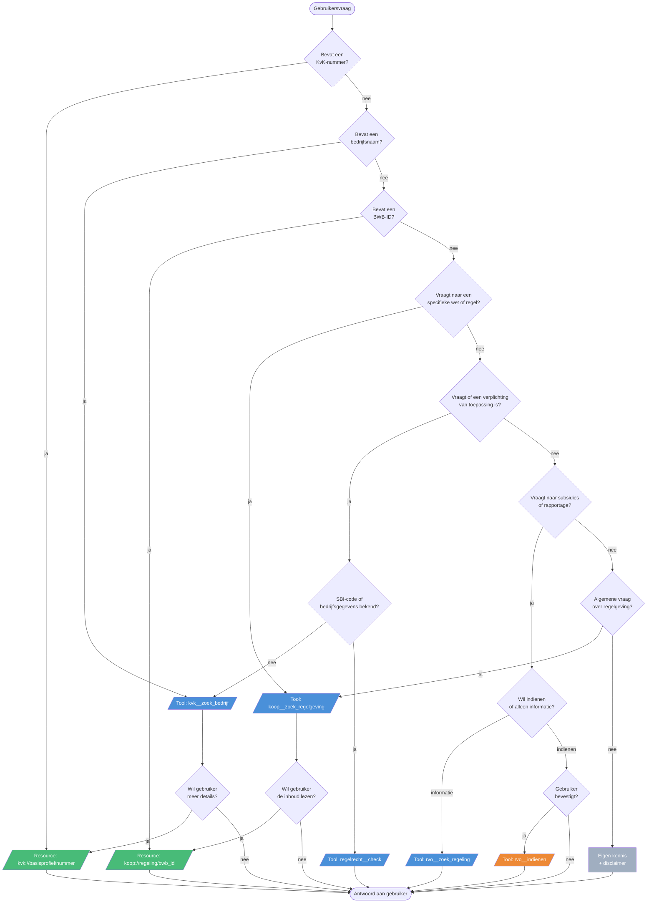

# MCP — Digitale Assistent met dual LLM-backend

MCP-laag van poc-moza. Biedt een digitale assistent die ondernemers helpt met regelgeving, subsidies en bedrijfsregistratie. Twee LLM-backends (VLAM en Claude) delen dezelfde MCP-tools.

Zie [Product Decisions Records](mcp/decisions) voor gemaakte keuzes in de opzet.
-  [PDR-001](decisions/PDR-001-dual-llm-backend.md) de achtergrond bij de dual-backend keuze.

## Architectuur

```
                     ┌──────────────────────────────────┐
  moza-portaal ─────▶│  host (poort 8000)                │
  /chat endpoint     │  VLAM (Mistral) of Claude         │
                     │  + MCP-tools (indien beschikbaar)  │
                     └──────┬───────┬───────┬───────┬────┘
                            │       │       │       │
                            ▼       ▼       ▼       ▼
                          kvk    koop   regelrecht  rvo
```

| Server | MCP-type | Bron |
|---|---|---|
| kvk | Resource | Handelsregister KvK (mock) |
| koop | Resource | KOOP Regelingenbank (productie-API) |
| regelrecht | Tool (non-muterend) | Beslislogica Informatieplicht |
| rvo | Tool (muterend) | RVO indienings-API (mock) |

De host werkt ook zonder MCP-servers — de assistent antwoordt dan op basis van eigen kennis.

## Routering: welke bron bij welke vraag?

Het LLM kiest op basis van de systeemprompt welke MCP-server wordt aangesproken. De routeringsregels zijn gedefinieerd in `host/prompts/blocks/shared/tool_usage.md` en volgen onderstaande beslisboom:



Legenda: **groen** = Resource (read-only ophalen), **blauw** = Tool (read-only zoeken/berekenen), **oranje** = Tool (muterend, vereist bevestiging), **grijs** = eigen kennis.

Bij gecombineerde vragen geldt de volgorde: KvK (wie?) → KOOP (welke regels?) → RegelRecht (van toepassing?) → RVO (actie ondernemen).

## Snel starten

```bash
cd mcp/host
cp .env.example .env        # Vul API-keys in
pip install -r requirements.txt
python api.py               # Start host op poort 8000
```

Start daarna het moza-portaal (`npm run dev` in de root) en open de Digitale Assistent-pagina.

### Met MCP-servers (Docker)

```bash
cd mcp
docker compose up --build
```

## Configuratie (.env)

```bash
# Claude (Anthropic)
ANTHROPIC_API_KEY=sk-ant-...
CLAUDE_MODEL=claude-sonnet-4-20250514

# VLAM (UbiOps/Mistral)
VLAM_API_KEY=...
VLAM_BASE_URL=https://api.demo.vlam.ai/v2.1/projects/poc/openai-compatible/v1
VLAM_MODEL_ID=ubiops-deployment/bzk-dig-chat//chat-model
```

Zonder VLAM-keys wordt alleen Claude beschikbaar.

## API

| Endpoint | Methode | Beschrijving |
|---|---|---|
| `/chat` | POST | Stuur bericht, ontvang antwoord. Body: `{ message, session_id?, mode? }` |
| `/health` | GET | Status van backends en MCP-servers |
| `/tools` | GET | Lijst van beschikbare MCP-tools |
| `/chat/{id}` | DELETE | Wis sessie |

## Mappenstructuur

```
mcp/
  README.md
  docker-compose.yml
  decisions/             Product Decision Records
  host/
    api.py               FastAPI REST-server
    vlam_host.py         LLM-orchestrator (VLAM + Claude)
    mcp_client.py        MCP-server verbindingen
    config.py            Configuratie
    prompts/             Modulaire systeemprompts
      composer.py        Stelt blokken samen tot system prompt
      blocks/
        identity/        Per-model identiteit (vlam.md, claude.md)
        shared/          Gedeelde blokken (tone, format, guardrails, ...)
          domain/        Domeinkennis per onderwerp
        model_specific/  Fijnsturing per model
      examples/          Few-shot voorbeelden
    requirements.txt
    Dockerfile
    .env.example
  servers/
    kvk/                 MCP Resource + Tool — Handelsregister
    koop/                MCP Resource + Tool — Regelingenbank
    regelrecht/          MCP Tool — beslislogica
    rvo/                 MCP Tool — indienen rapportage
```
