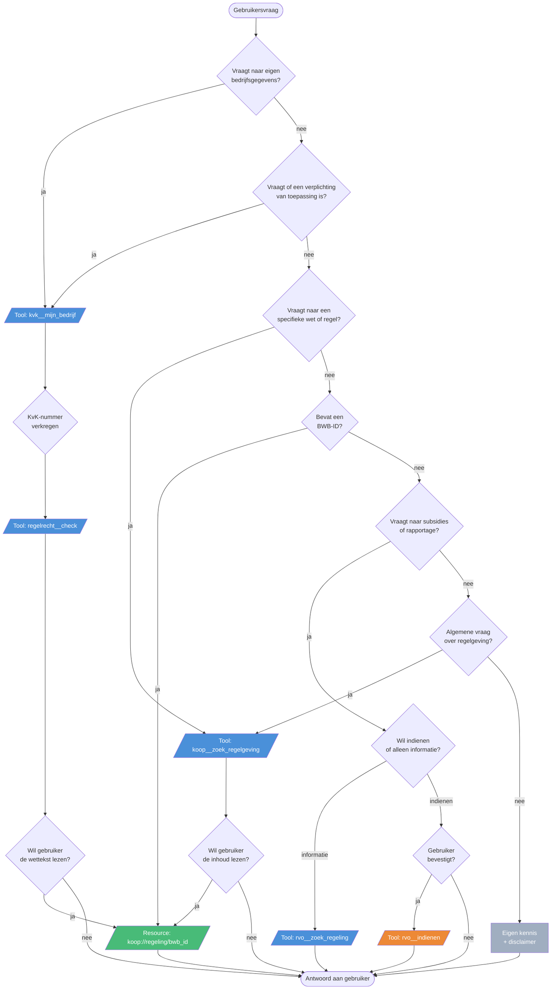
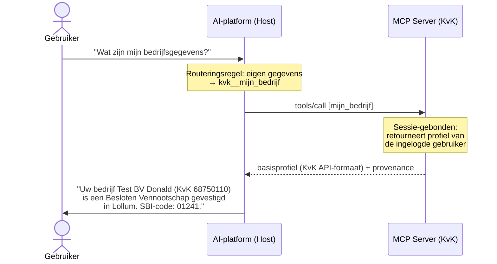
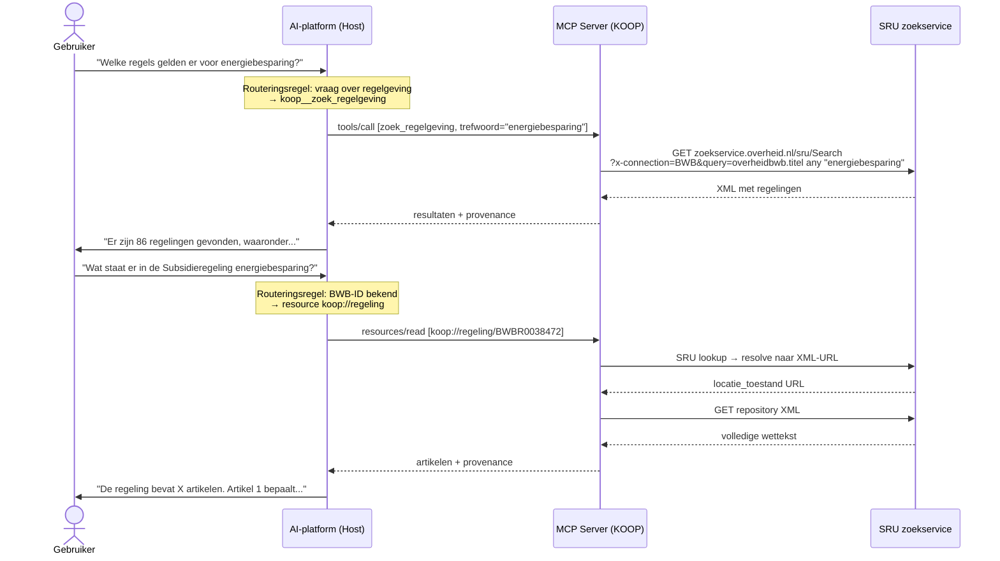
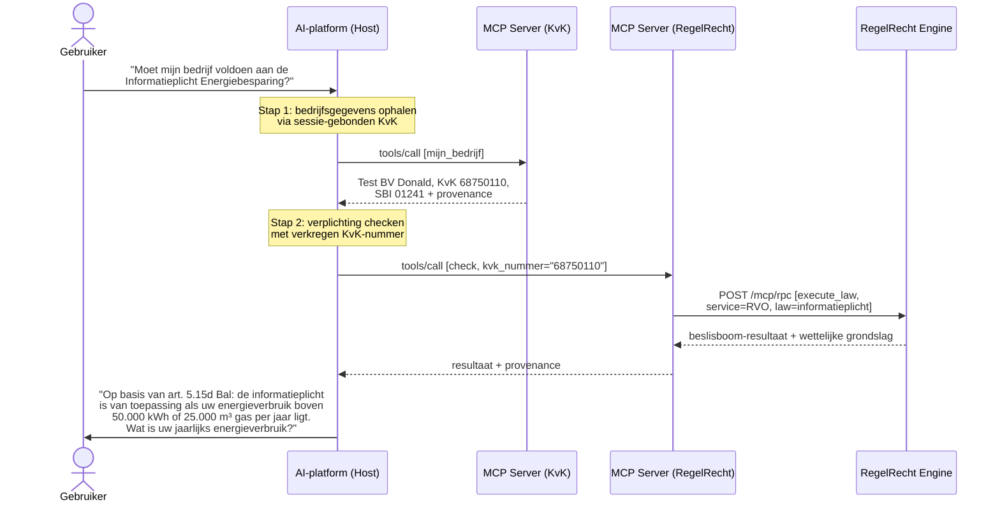
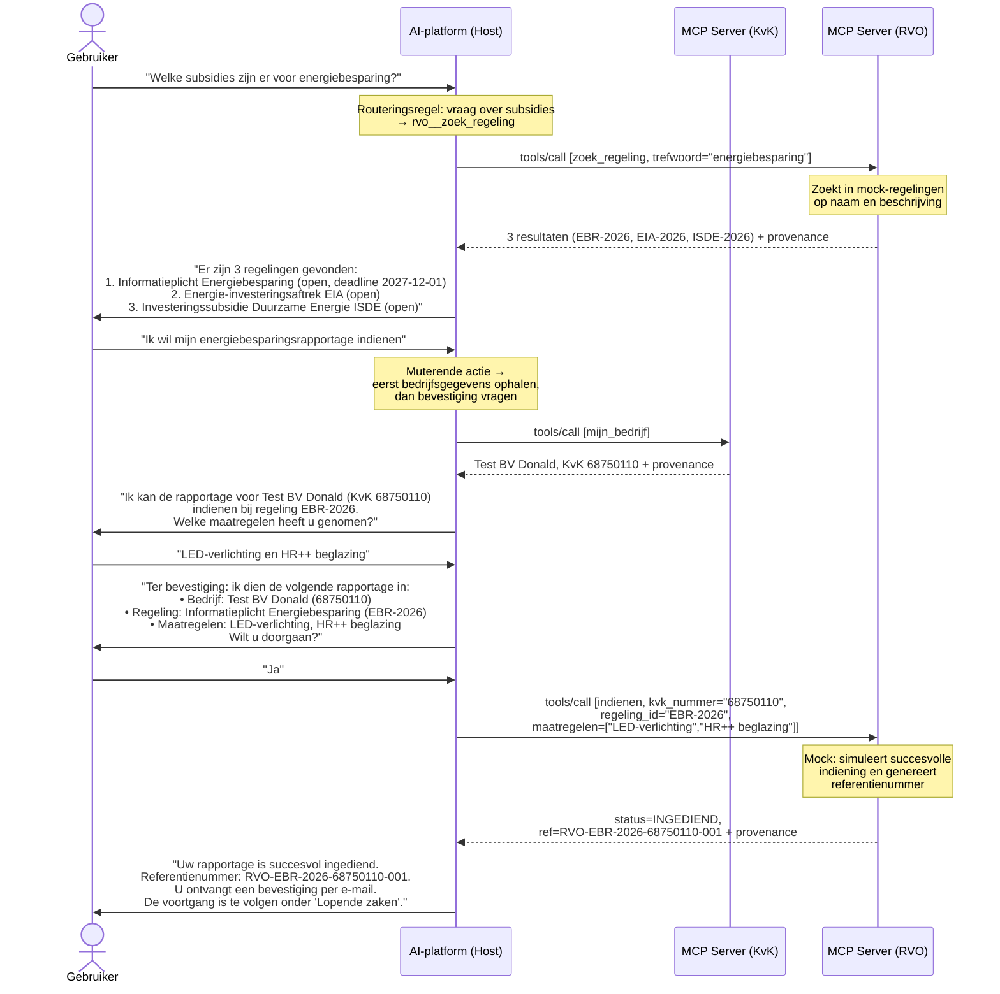
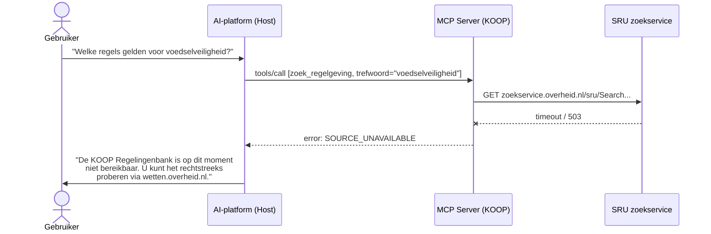

# Digitale Assistent

De Digitale Assistent biedt ondernemers hulp met regelgeving, subsidies en bedrijfsregistratie. Twee LLM-backends (VLAM en Claude) raadplegen overheidsbronnen via twee transportmechanismen: MCP en CLI. Beide zijn API-wrappers die dezelfde externe API's aanspreken — het verschil zit in hoe ze worden aangeroepen (zie [PDR-005](decisions/PDR-005-cli-vs-mcp-transport.md)).

Zie [Product Decision Records](decisions/) voor gemaakte keuzes in de opzet.
- [PDR-001](decisions/PDR-001-dual-llm-backend.md) — dual-backend keuze (VLAM + Claude)
- [PDR-005](decisions/PDR-005-cli-vs-mcp-transport.md) — CLI vs MCP als transport

## Architectuur

```
                     ┌──────────────────────────────────────────┐
  moza-portaal ─────▶│  host (poort 8000)                       │
  /chat endpoint     │  VLAM (Mistral) of Claude                │
                     │  + tools via MCP of CLI (instelbaar)      │
                     └──────┬───────┬───────┬───────┬───────────┘
                            │       │       │       │
                   MCP:  server   server  server  server  (Python, persistent)
                   CLI:  kvk-cli koop-cli rr-cli  rvo-cli (Bash, on-demand)
                            │       │       │       │
                            ▼       ▼       ▼       ▼
                          kvk.nl  koop    regelrecht rvo
                         (API)   (API)    (API)    (API)
```

| Bron | MCP-server | CLI-tool | Type | Externe API |
|---|---|---|---|---|
| KvK | Resource + Tool | `kvk-cli` | Bedrijfsgegevens (sessie-gebonden) | KvK Test API |
| KOOP | Resource + Tool | `koop-cli` | Regelingenbank | wetten.overheid.nl |
| RegelRecht | Tool (non-muterend) | `regelrecht-cli` | Beslislogica verplichtingen | poc-machine-law API |
| RVO | Tool (muterend) | `rvo-cli` | Subsidies en rapportages | RVO API (mock) |

De host werkt ook zonder MCP-servers of CLI-tools; de assistent antwoordt dan op basis van eigen kennis.

> **MCP vs CLI:** MCP-servers draaien als permanente processen en ondersteunen zowel tools als resources. CLI-tools zijn Bash-scripts die on-demand worden aangeroepen en alleen tools ondersteunen (geen resources). Zie [PDR-005](decisions/PDR-005-cli-vs-mcp-transport.md) voor een uitgebreide vergelijking.

> **KvK testomgeving:** De KvK-server haalt bedrijfsgegevens op via de KvK Test API (`api.kvk.nl/test/api/v1/basisprofielen`). Toegang is beperkt tot het bedrijf van de ingelogde gebruiker (demo: Test BV Donald, KvK 68750110). In productie wordt het KvK-nummer bepaald door de sessie-authenticatie.

## Routering: welke bron bij welke vraag?

Het LLM kiest op basis van de systeemprompt welke MCP-server wordt aangesproken. De routeringsregels zijn gedefinieerd in `host/prompts/blocks/shared/tool_usage.md` en volgen onderstaande beslisboom:



Legenda:
**groen** = Resource (read-only ophalen)
**blauw** = Tool (read-only zoeken/berekenen)
**oranje** = Tool (muterend, vereist bevestiging)
**grijs** = eigen kennis

Bij gecombineerde vragen geldt de volgorde: KvK (wie?) → RegelRecht (wat geldt er?) → KOOP (verdieping wettekst) → RVO (actie ondernemen).

## Voorbeeldscenario's

### Scenario 1: Eigen bedrijfsgegevens opvragen (KvK)

> Gebruiker: "Wat zijn mijn bedrijfsgegevens?"



### Scenario 2: Regelgeving zoeken (KOOP)

> Gebruiker: "Welke regels gelden er voor energiebesparing?"



### Scenario 3: Gecombineerde vraag (KvK + RegelRecht)

> Gebruiker: "Moet mijn bedrijf voldoen aan de Informatieplicht Energiebesparing?"



### Scenario 4: Subsidie zoeken en rapportage indienen (RVO)

> Gebruiker: "Welke subsidies zijn er voor energiebesparing?"



> **Let op:** De `indienen`-tool is muterend. Het AI-platform vraagt daarom *altijd* om expliciete bevestiging van de gebruiker voordat de tool wordt aangeroepen. Dit is afgedwongen via de `ToolAnnotations` (`readOnlyHint=False`) én de systeemprompt.

### Scenario 5: Bron niet beschikbaar

> Gebruiker: "Welke regels gelden voor voedselveiligheid?"



## Snel starten

```bash
cd mcp/host
cp .env.example .env        # Vul API-keys in
pip install -r requirements.txt
python api.py               # Start host op poort 8000
```

Start daarna het moza-portaal (`npm run dev` in de root) en open de Digitale Assistent-pagina.

### Met MCP-servers (Docker)

```bash
cd mcp
docker compose up --build
```

## Configuratie (.env)

```bash
# Claude (Anthropic)
ANTHROPIC_API_KEY=sk-ant-...
CLAUDE_MODEL=claude-sonnet-4-...

# VLAM (UbiOps/Mistral)
VLAM_API_KEY=...
VLAM_BASE_URL=https://...
VLAM_MODEL_ID=...
```

Zonder VLAM-keys wordt alleen Claude beschikbaar.

## API

| Endpoint | Methode | Beschrijving |
|---|---|---|
| `/chat` | POST | Stuur bericht, ontvang antwoord. Body: `{ message, session_id?, mode? }` |
| `/health` | GET | Status van backends en MCP-servers |
| `/tools` | GET | Lijst van beschikbare MCP-tools |
| `/chat/{id}` | DELETE | Wis sessie |

## Mappenstructuur

```
services/
  README.md
  docker-compose.yml
  decisions/               Product Decision Records (PDR-001 t/m PDR-005)
  host/
    api.py                 FastAPI REST-server
    vlam_host.py           LLM-orchestrator (VLAM + Claude, MCP + CLI)
    mcp_client.py          MCP-server verbindingen
    cli_executor.py        CLI tool-aanroepen via subprocess
    config.py              Configuratie
    prompts/               Modulaire systeemprompts
      composer.py          Stelt blokken samen tot system prompt
      blocks/
        identity/          Per-model identiteit (vlam.md, claude.md)
        shared/            Gedeelde blokken (tone, format, guardrails, ...)
          domain/          Domeinkennis per onderwerp
        model_specific/    Fijnsturing per model
      examples/            Few-shot voorbeelden
    requirements.txt
    Dockerfile
    .env.example
  mcp/                     MCP-servers (Python, persistent)
    kvk/                   Resource + Tool — Bedrijfsgegevens (KvK Test API)
    koop/                  Resource + Tool — Regelingenbank
    regelrecht/            Tool — beslislogica
    rvo/                   Tool — subsidies en rapportages
  cli/                     CLI-tools (Bash, on-demand)
    kvk-cli                API-wrapper KvK
    koop-cli               API-wrapper KOOP
    regelrecht-cli         API-wrapper RegelRecht
    rvo-cli                API-wrapper RVO
    lib/                   Gedeelde modules (output, provenance, audit)
```
